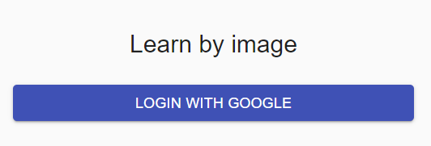
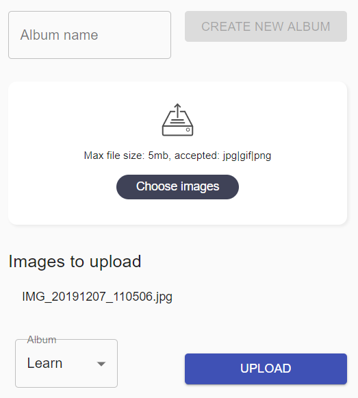

# google-photo-album

Upload photo to a Google Photo Album: after logged in to your Google account via OAUTH2, you will be able to upload some photos to an album.  
Those photos will be resized to 1024x600 pixel and the file name will be impressed to the photo.

My target was to easily upload photos of trees and leafs to see them in my Google Nest Hub gallery.

Morover, this is a playground project to learn some basics of React and Lerna.  
It is composed by two applications:

- packages/frontend: a react application started with `npx create-react-app frontend`
- packages/backend: a Fastify server to provide the APIs to edit the images and send them to Google Photo

## Run

```bash
npm run install:all # will install all the packages
npm run start:local # run it locally
# these scripts hide lerna, because I like to use npm to manage my projects
```

By default you can check the site at [http://localhost:3003/](http://localhost:3003/)

If you are not logged in you will see:



After the login you will be able to use the application:



### Auth to Google

In order to let it works, you need to configure the `packages\backend\nest-api-credentials.json` file with your own credentials that you can get from the Google Cloud Console following [these instructions](https://developers.google.com/identity/protocols/oauth2/web-server).

An example:

```json
{
  "web": {
    "client_id": "secret",
    "project_id": "your-project-id",
    "auth_uri": "https://accounts.google.com/o/oauth2/auth",
    "token_uri": "https://oauth2.googleapis.com/token",
    "auth_provider_x509_cert_url": "https://www.googleapis.com/oauth2/v1/certs",
    "client_secret": "very-secret",
    "javascript_origins": [
      "http://localhost:3003"
    ]
  }
}
```

## Disclaimer

This is a learning project, it is not intended for production at all.
Feel free to play with it.
